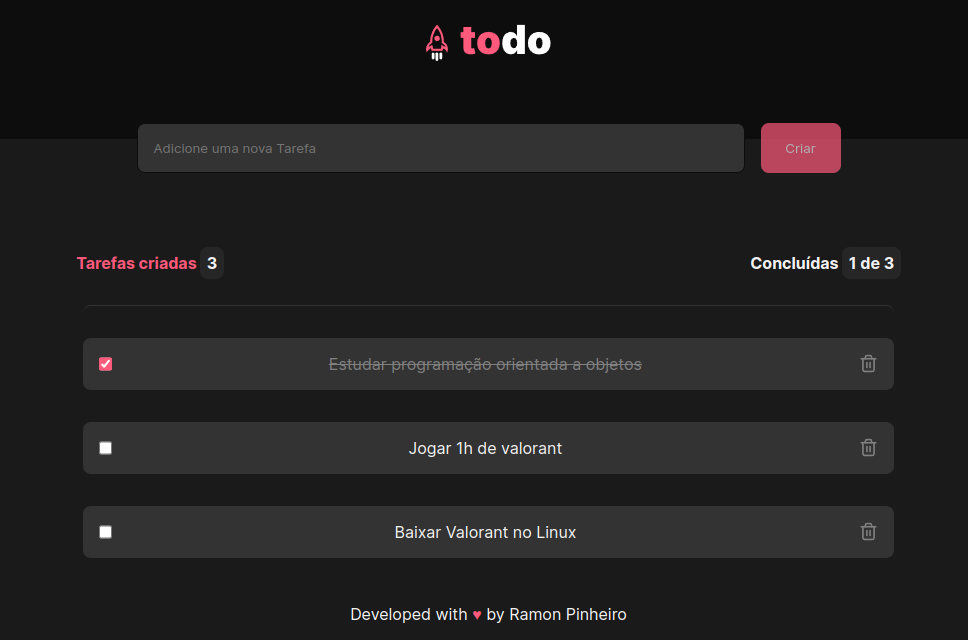

# Modern todo-list

I created this todolist project to exercise my skills about the main concepts of React, such as State and imutability. This project is made to use for check your day tasks.

[Click here to open the preview website](https://todo-list-ramontrovao.vercel.app/)

## 🚀 Techs

- React
- Typescript
- Sass
- Git and Github

## 🚨 Contact

ramontrov@gmail.com